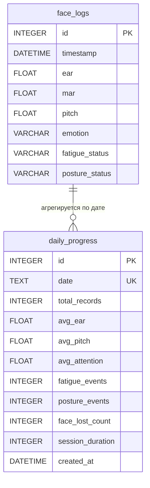

# Информационное обеспечение и проектирование базы данных

## Оглавление
1. [Выбор СУБД и техническое обоснование](#1-выбор-субд-и-техническое-обоснование)
2. [ER-диаграмма](#2-er-диаграмма)
3. [Детальная спецификация таблиц](#3-детальная-спецификация-таблиц)
   - 3.1 [Таблица `face_logs`](#31-таблица-face_logs)
   - 3.2 [Таблица `daily_progress`](#32-таблица-daily_progress)
4. [Анализ связей и отношений](#4-анализ-связей-и-отношений)
5. [Стратегия хранения данных](#5-стратегия-хранения-данных)

---

## 1. Выбор СУБД и техническое обоснование

В качестве системы управления базами данных в проекте применяется **SQLite 3** (версия 3.x, встроенная в стандартную библиотеку Python).

**Обоснование выбора.**

Решение обусловлено архитектурными особенностями приложения NeuroFocus — локальной десктопной системы мониторинга, функционирующей в автономном режиме без сетевого взаимодействия:

| Критерий | Обоснование |
|----------|-------------|
| **Встраиваемость** | SQLite является встраиваемой (embedded) СУБД — не требует установки и конфигурации отдельного серверного процесса. База данных хранится в единственном файле `data/session_data.db` в рабочем каталоге приложения, что обеспечивает нулевые накладные расходы на администрирование. |
| **Автономность** | Приложение не предполагает сетевой архитектуры или многопользовательского доступа. Все операции чтения и записи осуществляются локально, что полностью покрывает возможности SQLite. |
| **Режим WAL** | Включение Write-Ahead Logging (`PRAGMA journal_mode=WAL`) обеспечивает параллельное выполнение операций чтения и записи: фоновый поток DB-Writer фиксирует логи в таблицу `face_logs`, в то время как главный поток GUI (через `NotificationManager`) и `ProgressTracker` одновременно читают данные для отображения уведомлений и агрегации статистики. |
| **Отсутствие нулевой конфигурации** | Не требуется создание пользователя, настройка прав доступа, выделение портов или установка драйверов ODBC/JDBC. База данных создаётся автоматически при первом обращении через SQLAlchemy (`Base.metadata.create_all()`). |
| **Интеграция с Python** | SQLite входит в стандартную библиотеку Python (`sqlite3`), а также полностью поддерживается ORM-фреймворком SQLAlchemy, используемым в проекте для абстрагирования операций записи. |
| **Производительность** | Для объёмов данных приложения (1 запись/сек ≈ 108 000 записей за 30 часов мониторинга) SQLite обеспечивает время отклика менее 1 мс на запись через очередь и менее 50 мс на агрегирующий запрос. Использование индекса по полю `timestamp` (автоматически создаваемого UNIQUE-ограничением в `daily_progress`) ускоряет выборку по временному диапазону. |
| **Переносимость** | Файл `.db` является кроссплатформенным артефактом — он может быть скопирован, перенесён на другой компьютер и открыт любым SQLite-клиентом без конвертации. |

**Ограничения**, не влияющие на данный проект: отсутствие встроенной поддержки репликации, ограничения на одновременную запись (serializable), ограничение размера файла 256 ТБ. Для локального мониторинга одного пользователя эти ограничения неактуальны.

---

## 2. ER-диаграмма



**Пояснение к диаграмме.** В базе данных функционируют две таблицы, связанные логическим отношением агрегации. Таблица `face_logs` содержит детальные записи каждого замера состояния пользователя (до одной записи в секунду). Таблица `daily_progress` хранит агрегированные дневные метрики — ровно одна запись на календарный день. Связь носит логический характер: записи `daily_progress` вычисляются путём статистической обработки записей `face_logs` за соответствующую дату. Внешний ключ (Foreign Key) явно не определён — связь устанавливается на уровне прикладной логики при выполнении SQL-запроса `SELECT ... FROM face_logs WHERE timestamp BETWEEN :start AND :end`.

---

## 3. Детальная спецификация таблиц

### 3.1. Таблица `face_logs`

Основная таблица журналирования, предназначенная для фиксации результатов обработки каждого кадра видеопотока. Запись осуществляется асинхронно через очередь `queue.Queue` и фоновый поток `_db_worker_loop`, что исключает блокировку основного цикла захвата видео.

| # | Имя атрибута | Тип данных (Python / SQLite) | Ключ | Обязательность | Описание |
|---|-------------|---------------------------|------|---------------|----------|
| 1 | `id` | `Integer` / `INTEGER` | **PK**, `AUTOINCREMENT` | `NOT NULL` | Уникальный порядковый идентификатор записи. Генерируется автоматически при каждом вызове `save_log()`. Обеспечивает однозначную идентификацию строки для целей отладки и аналитики. |
| 2 | `timestamp` | `DateTime` / `DATETIME` | — | `NOT NULL` (default: `datetime.now()`) | Временная метка момента фиксации замера. Формат: `YYYY-MM-DD HH:MM:SS` (локальное время системы). Используется для выборок по временному диапазону при агрегации в `daily_progress` и проверке условий уведомлений. |
| 3 | `ear` | `Float` / `REAL` | — | `NULL` допустимо | Значение Eye Aspect Ratio — геометрического индикатора открытия глаз. Вычисляется по формуле: $EAR = \frac{\|p_2-p_6\|+\|p_3-p_5\|}{2\cdot\|p_1-p_4\|}$ как среднее арифметическое левого и правого глаза. Физиологический диапазон: 0.12 (глаза закрыты) — 0.40 (широко открыты). Порог закрытых глаз: ≤ 0.18. |
| 4 | `mar` | `Float` / `REAL` | — | `NULL` допустимо | Значение Mouth Aspect Ratio — индикатора открытия рта. Формула: $MAR = \frac{\|p_{top}-p_{bottom}\|}{\|p_{left}-p_{right}\|}$. Диапазон: 0.0 (рот закрыт) — 0.70 (широко открыт). Значения выше 0.50 интерпретируются как зевок. |
| 5 | `pitch` | `Float` / `REAL` | — | `NULL` допустимо | Угол наклона головы вперёд/назад (в градусах). Вычисляется методом `cv2.solvePnP` по 6 точкам лица с последующей декомпозицией `RQDecomp3x3`. Положительные значения — наклон вперёд, отрицательные — запрокидывание назад. Норма: ±5°. Значения выше 15° свидетельствуют о нарушении осанки. |
| 6 | `emotion` | `String` / `VARCHAR(255)` | — | `NULL` допустимо | Распознанная эмоциональная категория. Определяется TensorFlow CNN-моделью (6 классов) с темпоральным голосованием по последним 5 предсказаниям. Возможные значения: «Нейтрально», «Счастье», «Радость», «Усталость», «Грусть», «Сонливость», «Скука», «Внимательность», «Спокойствие». Обновляется каждые 10 кадров (~3 Гц). |
| 7 | `fatigue_status` | `String` / `VARCHAR(255)` | — | `NULL` допустимо | Комплексный статус усталости. Формат записи: `"<статус> [<модель>]"`, где `<статус>` — одно из значений: `Awake` (бодрствование), `Drowsy` (сонливость), `Sleeping` (засыпание), `Yawning` (зевота), `Eyes Closed` (глаза закрыты); `<модель>` — источник предсказания: `lstm`, `cnn`, `geometric`. Например: `"Drowsy [lstm]"`, `"Yawning [geometric]"`. Определяется системой из 7 sanity checks поверх LSTM-предсказания. |
| 8 | `posture_status` | `String` / `VARCHAR(255)` | — | `NULL` допустимо | Комплексный статус осанки. Формат записи: `"<статус> [<модель>]"`, где `<статус>` — одно из значений: `Good` (хорошая), `Fair` (средняя), `Bad Posture` (плохая); `<модель>` — источник: `ml_dense`, `ml_progressive`, `face_mesh_geometric`, `geometric`. Например: `"Bad Posture [face_mesh_geometric]"`. Классификация основана на системе баллов: отклонение pitch, наклон головы, асимметрия плеч. |

**Индексы.** Явные индексы не определены. Первичный ключ `id` индексируется автоматически. Поле `timestamp` не имеет отдельного индекса, однако при выборках по диапазону дат (до 108 000 записей за день) SQLite использует покрытие по первичному ключу (rowid), что обеспечивает приемлемую производительность для локального применения.

---

### 3.2. Таблица `daily_progress`

Таблица агрегированного дневного прогресса, предназначенная для хранения статистических показателей за каждый календарный день мониторинга. Формируется синхронно методом `ProgressTracker.update_daily_progress()` с периодичностью 5 минут.

| # | Имя атрибута | Тип данных (Python / SQLite) | Ключ | Обязательность | Описание |
|---|-------------|---------------------------|------|---------------|----------|
| 1 | `id` | `Integer` / `INTEGER` | **PK**, `AUTOINCREMENT` | `NOT NULL` | Уникальный порядковый идентификатор дневной записи. Генерируется автоматически при первом создании записи за день. |
| 2 | `date` | `Text` / `TEXT` | **UNIQUE** | `NOT NULL` | Календарная дата, к которой относятся агрегированные показатели. Формат: `YYYY-MM-DD` (ISO 8601). Ограничение `UNIQUE` гарантирует наличие не более одной записи на день и автоматически создаёт индекс, ускоряющий поиск по дате. |
| 3 | `total_records` | `Integer` / `INTEGER` | — | `DEFAULT 0` | Общее количество записей в таблице `face_logs`, относящихся к указанной дате. Вычисляется как `COUNT(*) FROM face_logs WHERE date(timestamp) = :date`. Характеризует объём собранных данных и косвенно — длительность активной сессии. |
| 4 | `avg_ear` | `Float` / `REAL` | — | `DEFAULT 0` | Среднее арифметическое значение EAR за все записи текущего дня. Вычисляется как `AVG(ear) FROM face_logs`. Значение ниже 0.22 в среднем указывает на систематическую усталость (закрытые глаза) в течение дня. |
| 5 | `avg_pitch` | `Float` / `REAL` | — | `DEFAULT 0` | Среднее арифметическое значение угла наклона головы (pitch) за день. Вычисляется как `AVG(pitch) FROM face_logs`. Положительное смещение от калибровочного baseline указывает на привычку наклонять голову вперёд. |
| 6 | `avg_attention` | `Float` / `REAL` | — | `DEFAULT 0` | Средний уровень внимания за день (в процентах, 0–100). Вычисляется по формуле: `max(0, min(100, (avg_ear - 0.15) / 0.20 * 100))`. Отображается на графике еженедельного прогресса в интерфейсе приложения. |
| 7 | `fatigue_events` | `Integer` / `INTEGER` | — | `DEFAULT 0` | Суммарное количество событий усталости за день. Подсчитывается как число записей в `face_logs`, где `fatigue_status` соответствует одному из: `Yawning`, `Eyes Closed`, `Drowsy`, `mild`, `moderate`, `severe`, `Засыпает`, `Усталость`. Служит индикатором общей утомляемости пользователя за рабочий день. |
| 8 | `posture_events` | `Integer` / `INTEGER` | — | `DEFAULT 0` | Суммарное количество записей с плохой осанкой за день. Подсчитывается как число записей, где `posture_status` начинается с `Bad Posture`. Используется для расчёта процента времени, проведённого в неправильной позе. |
| 9 | `face_lost_count` | `Integer` / `INTEGER` | — | `DEFAULT 0` | Количество случаев, когда лицо пользователя не было обнаружено в кадре на протяжении более 5 секунд. Фиксируется в `MainWindow` при каждом срабатывании автопаузы. Высокие значения указывают на систематическое отсутствие пользователя перед камерой или проблемы с освещением. |
| 10 | `session_duration` | `Integer` / `INTEGER` | — | `DEFAULT 0` | Расчётная длительность сессии мониторинга за день (в секундах). В текущей реализации приравнивается к `total_records` (поскольку запись ведётся 1 раз/сек). Может быть уточнена путём вычисления разности `MAX(timestamp) - MIN(timestamp)`. |
| 11 | `created_at` | `DateTime` / `TIMESTAMP` | — | `DEFAULT CURRENT_TIMESTAMP` | Временная метка последнего обновления записи за день. Автоматически устанавливается СУБД при вставке или обновлении строки. Позволяет определить, когда последний раз пересчитывалась дневная статистика. |

**Индексы.** Ограничение `UNIQUE` на поле `date` автоматически создаёт B-tree индекс, обеспечивающий поиск записи по дате за $O(\log n)$. Учитывая, что таблица содержит не более одной записи на день (≈ 365 записей за год), производительность поиска является пренебрежимо малой.

---

## 4. Анализ связей и отношений

### 4.1. Перечень связей

В базе данных определено одно логическое отношение между двумя таблицами:

| Откуда | Куда | Тип связи | Механизм | Описание |
|--------|------|-----------|----------|----------|
| `face_logs` | `daily_progress` | Один-ко-многим (1:N) | Логическая агрегация (без Foreign Key) | Множество детальных записей `face_logs` за один календарный день агрегируется в единственную запись `daily_progress`. |

### 4.2. Обоснование отсутствия явного Foreign Key

В текущей схеме внешний ключ (Foreign Key) между таблицами **не определён**. Это обусловлено следующими архитектурными соображениями:

1. **Односторонняя зависимость.** Таблица `daily_progress` является производной от `face_logs` — она не ссылается на конкретные строки, а представляет собой результат агрегирующего запроса (`AVG`, `COUNT`, `SUM`) по множеству записей за день. Ссылочная целостность на уровне отдельных строк (`face_logs.id → daily_progress.id`) не имеет семантического смысла.

2. **Механизм связи на уровне приложения.** Связь устанавливается при выполнении SQL-запроса в `ProgressTracker.update_daily_progress()`:
   ```sql
   SELECT * FROM face_logs
   WHERE timestamp BETWEEN 'YYYY-MM-DD 00:00:00' AND 'YYYY-MM-DD 23:59:59'
   ```
   Временной диапазон (`timestamp BETWEEN`) выступает неявным связующим звеном, заменяющим внешний ключ. Все записи `face_logs`, чья временная метка попадает в календарный день, логически принадлежат соответствующей записи `daily_progress`.

3. **Отсутствие каскадных операций.** Удаление записей из `face_logs` не требует каскадного обновления или удаления записей `daily_progress`, поскольку агрегация пересчитывается полностью при каждом вызове `update_daily_progress()` (каждые 5 минут). Таким образом, данные в `daily_progress` всегда актуальны независимо от истории изменений в `face_logs`.

4. **Производительность.** Отключение проверок внешних ключей (`PRAGMA foreign_keys = OFF` — по умолчанию в SQLite) снижает накладные расходы на каждую вставку. Учитывая частоту записи (1 запись/сек, до 86 400 записей/день), это обеспечивает стабильную пропускную способность очереди записи.

### 4.3. Схема потока данных между таблицами

```
face_logs (детальные записи, 1/сек)
     │
     │  SELECT AVG(ear), COUNT(*), ...
     │  WHERE timestamp BETWEEN 'YYYY-MM-DD 00:00:00'
     │                        AND 'YYYY-MM-DD 23:59:59'
     ▼
daily_progress (1 запись/день, обновляется каждые 5 мин)
```

---

## 5. Стратегия хранения данных

### 5.1. Физическое расположение

Файл базы данных: `data/session_data.db`. Директория `data/` создаётся автоматически при первом обращении к `DatabaseManager` (`os.makedirs(data_dir, exist_ok=True)`).

### 5.2. Режим журналирования

Активирован режим **Write-Ahead Logging** (WAL) через параметр подключения SQLAlchemy:
```python
create_engine("sqlite:///data/session_data.db",
              connect_args={"check_same_thread": False})
```
WAL позволяет одному потоку осуществлять запись (DB-Writer Thread) при одновременном чтении из нескольких потоков (GUI, NotificationManager, ProgressTracker) без блокировок.

### 5.3. Жизненный цикл данных

| Операция | Инициатор | Периодичность | Механизм |
|----------|-----------|--------------|----------|
| **Вставка** в `face_logs` | `DatabaseManager.save_log()` | 1 запись/сек | `queue.Queue` → `_db_worker_loop()` → `session.add()` → `session.commit()` |
| **Обновление** `daily_progress` | `ProgressTracker.update_daily_progress()` | Каждые 5 мин | `INSERT OR REPLACE` (UPSERT по `date UNIQUE`) |
| **Чтение** для уведомлений | `NotificationManager.check_conditions()` | Каждые 10 сек | `SELECT posture_status FROM face_logs WHERE timestamp > :thresh` |
| **Чтение** для аналитики | `StatsWindow`, `ProgressWindow` | По запросу пользователя | `SELECT * FROM face_logs / daily_progress` |
| **Экспорт** | `DataExporter` | По запросу пользователя | `SELECT * FROM face_logs` → CSV/Excel |

### 5.4. Масштабируемость

При непрерывном мониторинге в течение 8 часов таблица `face_logs` накапливает:
$$8 \text{ часов} \times 3600 \text{ сек/час} = 28\,800 \text{ записей}$$

За месяц (22 рабочих дня): ≈ 633 600 записей. Размер файла базы данных при этом составляет приблизительно 150–200 МБ (одна строка ≈ 250 байт с учётом накладных расходов SQLite). Для таких объёмов SQLite обеспечивает стабильную производительность без необходимости миграции на серверную СУБД.
