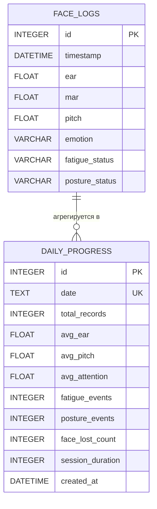
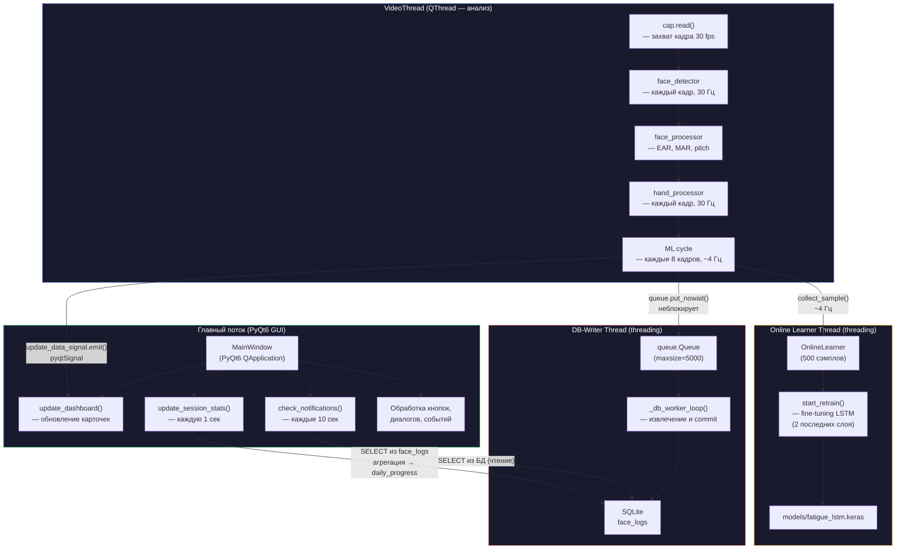

# NeuroFocus — Проектная документация

## Оглавление
1. [Моделирование бизнес-процессов и функций](#1-моделирование-бизнес-процессов-и-функций)
   - 1.1 [Контекстная диаграмма IDEF0](#11-контекстная-диаграмма-idef0)
   - 1.2 [Декомпозиция IDEF0](#12-декомпозиция-idef0)
   - 1.3 [Диаграмма вариантов использования (Use Case)](#13-диаграмма-вариантов-использования-use-case)
2. [Проектирование базы данных](#2-проектирование-базы-данных)
   - 2.1 [ER-диаграмма](#21-er-диаграмма)
   - 2.2 [Структура хранения данных](#22-структура-хранения-данных)
   - 2.3 [Описание атрибутов таблиц](#23-описание-атрибутов-таблиц)
3. [Алгоритмическое обеспечение](#3-алгоритмическое-обеспечение)
   - 3.1 [Схема-алгоритм работы приложения (Flowchart)](#31-схема-алгоритм-работы-приложения-flowchart)
   - 3.2 [Текстовое описание алгоритма](#32-текстовое-описание-алгоритма)
4. [Структура и компоненты приложения](#4-структура-и-компоненты-приложения)
   - 4.1 [Описание программных модулей](#41-описание-программных-модулей)
   - 4.2 [Многопоточная архитектура](#42-многопоточная-архитектура)

---

## 1. Моделирование бизнес-процессов и функций

### 1.1. Контекстная диаграмма IDEF0

На верхнем уровне (уровень A-0) система NeuroFocus представляется как единый функциональный блок **A-0 «Осуществлять мониторинг состояния пользователя за компьютером»**.

```mermaid
graph TD
    subgraph INPUTS ["ВХОДЫ (Inputs)"]
        I1["Видеопоток с камеры\n(1280x720, 30 fps)"]
        I2["Биометрические данные\nпользователя (лицо, руки)"]
    end

    subgraph CONTROLS ["УПРАВЛЕНИЕ (Controls)"]
        C1["config.json\n(параметры обработки)"]
        C2["Физиологические нормы\n(EAR >= 0.28, pitch < 15°)"]
        C3["Пороги уведомлений\n(кулдаун, лимиты)"]
        C4["Калибровочные данные\n(профиль пользователя)"]
    end

    subgraph MECHANISMS ["МЕХАНИЗМЫ (Mechanisms)"]
        M1["CPU: Intel i5+ /\nAMD Ryzen 5+"]
        M2["GPU (опц.): TensorFlow\nCUDA"]
        M3["Библиотеки ML:\nMediaPipe, TensorFlow,\nOpenCV"]
        M4["Python 3.11,\nPyQt6, SQLAlchemy"]
    end

    subgraph FUNCTION["A-0\nОсуществлять\nмониторинг\nсостояния\nпользователя"]
        style FUNCTION fill:#1a1a2e,color:#fff,stroke:#6B8AFE,stroke-width:3px
    end

    subgraph OUTPUTS ["ВЫХОДЫ (Outputs)"]
        O1["Визуализированный\nвидеопоток с наложением\nландмартов"]
        O2["Метрики состояния:\nуровень внимания,\nэмоция, осанка"]
        O3["Уведомления и\nоповещения (Toast,\nзвук)"]
        O4["Управление курсором\nмыши (pyautogui)"]
        O5["Записи логов в БД\n(ear, mar, pitch,\nstatus)"]
        O6["Графики и аналитика\nсессий (Pandas,\nMatplotlib)"]
    end

    I1 --> FUNCTION
    I2 --> FUNCTION
    C1 --> FUNCTION
    C2 --> FUNCTION
    C3 --> FUNCTION
    C4 --> FUNCTION
    M1 --> FUNCTION
    M2 --> FUNCTION
    M3 --> FUNCTION
    M4 --> FUNCTION
    FUNCTION --> O1
    FUNCTION --> O2
    FUNCTION --> O3
    FUNCTION --> O4
    FUNCTION --> O5
    FUNCTION --> O6

    classDef inputs fill:#2d2d44,stroke:#4ADE80,color:#fff
    classDef controls fill:#2d2d44,stroke:#FBBF24,color:#fff
    classDef mechanisms fill:#2d2d44,stroke:#6B8AFE,color:#fff
    classDef outputs fill:#2d2d44,stroke:#F87171,color:#fff
    class I1,I2 inputs
    class C1,C2,C3,C4 controls
    class M1,M2,M3,M4 mechanisms
    class O1,O2,O3,O4,O5,O6 outputs
```



**Пояснение к контекстной диаграмме.** Входными данными системы является непрерывный видеопоток с веб-камеры пользователя, содержащий биометрическую информацию (область лица и рук). Управление осуществляется конфигурационным файлом `config.json`, определяющим параметры обработки, физиологическими нормативами (пороговые значения EAR, MAR, углов наклона головы), а также персонализированными калибровочными данными, накапливаемыми в процессе эксплуатации. Механизмами реализации выступают вычислительные ресурсы центрального (CPU) и графического (GPU) процессоров, а также программные библиотеки компьютерного зрения и машинного обучения: MediaPipe (детекция ландмартов), TensorFlow/Keras (нейросетевая классификация), OpenCV (геометрические преобразования). На выходе формируются: визуализированный видеопоток с наложенными ландмартами, количественные метрики состояния пользователя, всплывающие и звуковые уведомления, команды управления курсором мыши, записи журналов в базу данных и аналитические отчёты.

---

### 1.2. Декомпозиция IDEF0 (диаграмма A0)

Ниже представлена развёрнутая декомпозиция основного процесса. Четыре функциональных блока расположены каскадом слева направо. Для каждого блока показаны все четыре типа связей ICOM: **входы** (I, слева), **управления** (C, сверху), **механизмы** (M, снизу), **выходы** (O, справа). Внутренние стрелки демонстрируют передачу данных между блоками — выходы одного процесса становятся входами или управлениями для последующих.

```mermaid
flowchart LR
    %% ===== ВНЕШНИЕ ВХОДЫ (Inputs) =====
    I_Video["Видеопоток с камеры\n1280x720, 30 fps, BGR"]
    I_BioData["Биометрия пользователя\nобласть лица и рук в кадре"]

    %% ===== ВНЕШНЕЕ УПРАВЛЕНИЕ (Controls) =====
    C_Config["config.json\nчастота ML, кулдауны,\nпороги, чувствительность"]
    C_PhysNorm["Физиологические нормы\nEAR >= 0.28 — глаза открыты\nEAR <= 0.18 — глаза закрыты\nMAR > 0.50 — зевота\n|yaw| <= 40° — лицо валидно"]
    C_AlertRule["Правила уведомлений\nосанка > 30% за 3 мин\nзевки > 3 за 10 мин\nработа > 45 мин без перерыва"]
    C_CalibData["Калибровочные данные\nперсональные пороги EAR/MAR\nbaseline pitch, зона жестов"]

    %% ===== ВНЕШНИЕ МЕХАНИЗМЫ (Mechanisms) =====
    M_CPU["CPU: Intel i5+ /\nAMD Ryzen 5+"]
    M_GPU["GPU (опц.): NVIDIA CUDA\nускорение TensorFlow"]
    M_ML["Библиотеки ML:\nMediaPipe (Face, Pose, Hands)\nTensorFlow/Keras (CNN+LSTM)\nOpenCV (solvePnP, геометрия)"]
    M_Py["Python 3.11, PyQt6,\nSQLAlchemy, pyautogui"]

    %% ===== ВНЕШНИЕ ВЫХОДЫ (Outputs) =====
    O_VideoUI["Визуализированный видеопоток\nс наложением ландмартов\nлица и рук"]
    O_Metrics["Метрики в реальном времени:\nуровень внимания %, эмоция,\nстатус осанки, усталость"]
    O_Alerts["Всплывающие уведомления\n(Toast) и звуковые сигналы"]
    O_Mouse["Команды управления мышью:\nперемещение, клики, скролл"]
    O_Logs["Записи логов в БД SQLite:\near, mar, pitch, статусы\n(1 запись/сек)"]
    O_Analytics["Графики и отчёты сессий:\nPandas + Matplotlib,\nэкспорт CSV/Excel"]

    %% ===== БЛОК A1: Сбор и первичная обработка =====
    subgraph A1 ["A1 — Сбор и первичная обработка данных"]
        A1_S1["Захват кадра с камеры\nOpenCV VideoCapture"]
        A1_S2["Детекция лица\nMediaPipe Face Mesh → 478 точек"]
        A1_S3["Расчёт EAR (оба глаза)\nформула Евклида по 6 точкам/глаз"]
        A1_S4["Расчёт MAR (рот)\nформула Евклида по 4 точкам"]
        A1_S5["Оценка позы головы\nsolvePnP → pitch / yaw / roll"]
        A1_S6["Детекция руки\nMediaPipe Hands → 21 точка"]
        A1_Check{"Лицо валидно?\ndetected ∧ |yaw| <= 40°"}
        A1_S1 --> A1_S2 --> A1_S3
        A1_S2 --> A1_S4
        A1_S2 --> A1_S5
        A1_S6
        A1_S3 --> A1_Check
        A1_S4 --> A1_Check
        A1_S5 --> A1_Check
    end

    %% ===== БЛОК A2: ML-анализ =====
    subgraph A2 ["A2 — Анализ метрик и машинное обучение"]
        A2_S1["Обновление адаптера порогов\nThresholdAdapter: warm-up 60с\nпауза при потере лица"]
        A2_S2["BlinkTracker: подсчёт\nчастоты морганий/мин"]
        A2_S3["MicrosleepDetector:\nзакрытие глаз >= 1.5с"]
        A2_S4["TemporalFeatureExtractor:\nокно 30 кадров, 16 признаков"]
        A2_S5["LSTM-предсказание усталости\n30 кадров × 16 признаков\n→ awake / drowsy / sleeping"]
        A2_S6["CNN-предсказание по eye region\n(если область глаз извлечена)"]
        A2_S7["Sanity Checks: 7 правил\nEAR < 0.18 → принудительно sleeping\ncounter low-EAR frames >= 5"]
        A2_S8["Классификация осанки\nPose Dense MLP или\nFace Mesh fallback: head_tilt + pitch_dev"]
        A2_S9["Распознавание эмоций\nTensorFlow CNN, каждые 10 кадров"]

        A2_S1 --> A2_S2 --> A2_S4 --> A2_S5
        A2_S2 --> A2_S3
        A2_S4 --> A2_S3
        A2_S5 --> A2_S7
        A2_S6 --> A2_S7
        A2_S7 --> A2_S8
        A2_S8 --> A2_S9
    end

    %% ===== БЛОК A3: Формирование статусов =====
    subgraph A3 ["A3 — Формирование статусов и проверка условий"]
        A3_S1["Расчёт композитного скора усталости\n5 компонентов: EAR(0.55) + MAR(0.15)\n+ blink(0.10) + emotion(0.10) + trend(0.10)\n→ FatigueScore 0-100"]
        A3_S2["Мгновенный штраф к скорy\nEAR <= 0.18 → fatigue >= 85\nEAR < 0.22 → fatigue >= 60+"]
        A3_S3["Определение posture_alert_level\nbad (>= 35 баллов) → красный\nfair (15-34 балла) → жёлтый"]
        A3_S4["Проверка условий уведомлений\nNotificationManager: запрос БД\nза 3-10 мин, сравнение с порогами"]
        A3_S5["Генерация событий\nзевок, усталость, наклон головы\nс cooldown (2-30 сек)"]

        A3_S1 --> A3_S2 --> A3_S5
        A3_S2 --> A3_S3 --> A3_S5
        A3_S3 --> A3_S4
    end

    %% ===== БЛОК A4: UI и логирование =====
    subgraph A4 ["A4 — Взаимодействие с пользователем и сохранение логов"]
        A4_S1["Обновление dashboard\nкарточки эмоций/внимания\nпрогресс-бар, статус осанки\nсписок событий (QListWidget)"]
        A4_S2["Управление жестами\npyautogui.moveTo / click / scroll\nадаптивный EMA, dead-zone 6px"]
        A4_S3["Отображение уведомлений\nToast-виджет с fade-анимацией\nзвук через pygame/winsound"]
        A4_S4["Асинхронная запись в БД\nqueue.Queue → DB-Writer Thread\nSQLite WAL mode, 1 запись/сек"]
        A4_S5["Агрегация дневного прогресса\nкаждые 5 мин: avg_ear, avg_pitch\nevents count → daily_progress"]

        A4_S1 --> A4_S3
        A4_S2
        A4_S3 --> A4_S4
        A4_S4 --> A4_S5
    end

    %% ==================== ICOM-СВЯЗИ ДЛЯ A1 ====================
    %% Входы A1 (слева)
    I_Video -->|"Вход: кадр BGR\nкаждые 33 мс"| A1
    I_BioData -.->|"Вход: лицо/руки\nв зоне видимости"| A1

    %% Управления A1 (сверху)
    C_Config -->|"Упр.: fps, разрешение,\nпорог yaw"| A1
    C_PhysNorm -->|"Упр.: валидность лица\n|yaw| <= 40°"| A1
    C_CalibData -.->|"Упр.: auto-calib\nсбор 30 сэмплов"| A1

    %% Механизмы A1 (снизу)
    M_CPU --> M_CPU_A1["CPU: захват кадра,\nFace Mesh, Hands"]
    M_ML --> M_ML_A1["MediaPipe:\nFace Mesh, Hands"]
    M_Py --> M_Py_A1["OpenCV:\ncapture, flip, solvePnP"]
    M_CPU_A1 -.- A1
    M_ML_A1 -.- A1
    M_Py_A1 -.- A1

    %% Выходы A1 (справа → входы A2, A3, A4)
    A1 -->|"Выход: EAR, MAR, pitch,\nlandmarks лица, valid"| A2
    A1 -->|"Выход: landmarks руки\n(21 точка), кадр"| A4
    A1 -->|"Выход: кадр с ландмартами\nлица для отрисовки"| A4
    A1_Check -.->|"Упр.: face_is_visible=True/False\nпауза адаптера порогов"| A2

    %% ==================== ICOM-СВЯЗИ ДЛЯ A2 ====================
    %% Управления A2 (сверху)
    C_Config -->|"Упр.: ml_update_interval=8\nинтервал LSTM"| A2
    C_PhysNorm -->|"Упр.: пороги sanity checks\nEAR < 0.18, MAR > 0.50"| A2
    C_CalibData -.->|"Упр.: персональные EAR пороги\nбимодальная кластеризация"| A2

    %% Механизмы A2 (снизу)
    M_GPU -.- A2
    M_ML --> M_ML_A2["TensorFlow:\nCNN, LSTM, Dense MLP"]
    M_Py --> M_Py_A2["numpy, deque:\nвременные окна 30 кадров"]
    M_ML_A2 -.- A2
    M_Py_A2 -.- A2

    %% Выходы A2 (справа → входы A3)
    A2 -->|"Выход: fatigue_score,\nstatus: awake/drowsy/sleeping\nconfidence, model_used"| A3
    A2 -->|"Выход: posture_status\ngood/fair/bad\nposture_score, alert_level"| A3
    A2 -->|"Выход: emotion\n(Нейтрально/Счастье/Усталость\nи т.д.), blink_rate/мин"| A3
    A2 -->|"Выход: microsleep\ndanger_level, yawning"| A3

    %% ==================== ICOM-СВЯЗИ ДЛЯ A3 ====================
    %% Управления A3 (сверху)
    C_AlertRule -->|"Упр.: пороги уведомлений\n% осанки, кол-во зевков"| A3
    C_PhysNorm -->|"Упр.: пороги classify\nbad_score >= 35 → bad\n>= 15 → fair"| A3

    %% Механизмы A3 (снизу)
    M_CPU -.- A3
    M_Py --> M_Py_A3["collections.deque:\nокна трендов, cooldown"]
    M_Py_A3 -.- A3

    %% Выходы A3 (справа → входы A4)
    A3 -->|"Выход: уровень внимания %\n= 100 - fatigue_score"| A4
    A3 -->|"Выход: событие:\nзевок, усталость,\nнаклон головы"| A4
    A3 -->|"Выход: уведомление?\nToast: текст, цвет\n(осанка/усталость/перерыв)"| A4

    %% ==================== ICOM-СВЯЗИ ДЛЯ A4 ====================
    %% Управления A4 (сверху)
    C_Config -->|"Упр.: save_log_interval=1с\nnotify_check=10с"| A4
    C_AlertRule -.->|"Упр.: кулдауны\n30с (bad), 45с (fair)"| A4

    %% Механизмы A4 (снизу)
    M_CPU -.- A4
    M_Py --> M_ML_A4["PyQt6: dashboard,\nToast, QListWidget"]
    M_ML --> M_ML_A4["pyautogui:\nmoveTo, click, scroll"]
    M_ML_A4 -.- A4
    M_Py --> M_Py_A4["SQLAlchemy + queue:\nasync DB writer"]
    M_Py_A4 -.- A4

    %% Внешние выходы A4 (справа)
    A4 --> O_VideoUI
    A4 --> O_Metrics
    A4 --> O_Alerts
    A4 --> O_Mouse
    A4 --> O_Logs
    A4 --> O_Analytics

    %% ===== СТИЛИ =====
    classDef a1 fill:#1a1a2e,stroke:#4ADE80,color:#fff,stroke-width:2px
    classDef a2 fill:#1a1a2e,stroke:#6B8AFE,color:#fff,stroke-width:2px
    classDef a3 fill:#1a1a2e,stroke:#FBBF24,color:#fff,stroke-width:2px
    classDef a4 fill:#1a1a2e,stroke:#F87171,color:#fff,stroke-width:2px
    classDef inputs fill:#2d2d44,stroke:#4ADE80,color:#fff,stroke-width:2px
    classDef controls fill:#2d2d44,stroke:#FBBF24,color:#fff,stroke-width:2px
    classDef mechanisms fill:#2d2d44,stroke:#6B8AFE,color:#fff,stroke-width:2px
    classDef outputs fill:#2d2d44,stroke:#F87171,color:#fff,stroke-width:2px
    class A1,A1_S1,A1_S2,A1_S3,A1_S4,A1_S5,A1_S6,A1_Check a1
    class A2,A2_S1,A2_S2,A2_S3,A2_S4,A2_S5,A2_S6,A2_S7,A2_S8,A2_S9 a2
    class A3,A3_S1,A3_S2,A3_S3,A3_S4,A3_S5 a3
    class A4,A4_S1,A4_S2,A4_S3,A4_S4,A4_S5 a4
    class I_Video,I_BioData inputs
    class C_Config,C_PhysNorm,C_AlertRule,C_CalibData controls
    class M_CPU,M_GPU,M_ML,M_Py mechanisms
    class O_VideoUI,O_Metrics,O_Alerts,O_Mouse,O_Logs,O_Analytics outputs
```



#### Текстовое описание декомпозиции IDEF0 (A0)

##### Блок A1 — Сбор и первичная обработка данных

**Назначение.** Осуществляется непрерывный захват видеопотока и извлечение из каждого кадра биометрических признаков лица и рук пользователя.

**Входы (I):**
- Видеопоток с камеры — кадры 1280×720 в цветовом пространстве BGR, частота 30 кадров/сек.
- Биометрические данные — физическое присутствие лица и/или рук пользователя в поле зрения камеры.

**Управления (C):**
- `config.json` — определяет разрешение захвата, частоту кадров, порог допустимого yaw (40°), интервалы обновления ML-моделей.
- Физиологические нормы — задают критерий валидности обнаруженного лица: лицо считается достоверным только если `detected == True` и абсолютное значение угла поворота головы `|yaw| ≤ 40°`. При выходе за этот предел метрики не рассчитываются.
- Калибровочные данные — если запущена автоматическая калибровка, блок собирает сэмплы EAR, MAR и pitch (до 30 значений) для последующего расчёта персональных порогов.

**Механизмы (M):**
- CPU — выполняет захват кадра (OpenCV `VideoCapture`), горизонтальное отражение, детекцию лиц и рук.
- MediaPipe Face Mesh — обнаруживает лицо и возвращает 478 трёхмерных ландмартов (координаты x, y, z ∈ [0, 1]).
- MediaPipe Hands — обнаруживает кисть и возвращает 21 ландмаркт.
- OpenCV — функция `solvePnP` для оценки позы головы по 6 точкам лица + `RQDecomp3x3` для декомпозиции в углы Эйлера.
- `geometry.py` — чистые математические функции расчёта EAR и MAR по формуле Евклида.

**Выходы (O) → следующие блоки:**
- → **A2:** EAR (среднее по обоим глазам, диапазон 0.12–0.40), MAR (0.0–0.70), pitch/yaw/roll (градусы), флаг `valid`, ландмарты лица.
- → **A2 (управление):** `face_is_visible` (True/False) — если False, адаптер порогов ставит warm-up на паузу.
- → **A4:** Кадр с наложенными ландмартами лица и рук (для отображения в UI), координаты руки (21 точка для жестового управления).

---

##### Блок A2 — Анализ метрик и машинное обучение

**Назначение.** Выполняется комплексный анализ временных рядов биометрических признаков с использованием нейросетевых моделей (CNN, LSTM, Dense MLP) и системы предохранителей.

**Входы (I):**
- От A1: EAR, MAR, pitch, ландмарты лица, флаг валидности лица, координаты руки.

**Управления (C):**
- `config.json` — интервал тяжёлого ML-цикла (`ml_update_interval = 8`, т.е. ~4 Гц).
- Физиологические нормы — пороговые значения для sanity checks: EAR < 0.18 (глаза закрыты), MAR > 0.50 (зевота), `ear_clearly_open` (персонализированный).
- Калибровочные данные — персональные пороги EAR/MAR, полученные бимодальной кластеризацией за 60 секунд warm-up.

**Механизмы (M):**
- GPU (опционально) — ускоряет инференс LSTM и CNN через CUDA.
- TensorFlow/Keras — CNN (eye region, 64×64×1), LSTM (30 кадров × 16 признаков, архитектура: LSTM(64)→LSTM(32)→Dense(32)→Dense(3,softmax)), Dense MLP для осанки (7 признаков → good/fair/bad).
- MediaPipe Pose Landmarker — 33 точки тела (плечи, бёдра, нос) для ML-классификации осанки.
- numpy, deque — буферы временных окон (30 кадров), расчёт mean/std/min/max/trend.

**Выходы (O) → следующие блоки:**
- → **A3:** `fatigue_score` (0–100), `status` (awake/drowsy/sleeping), `confidence`, `posture_status` (good/fair/bad), `posture_score`, `posture_alert_level` (bad/fair), `emotion` (6 классов), `blink_rate` (морганий/мин), `microsleep_detected`, `yawning`.

---

##### Блок A3 — Формирование статусов и проверка условий уведомлений

**Назначение.** Рассчитывается интегральная оценка состояния пользователя, проверяются условия для генерации уведомлений и событий.

**Входы (I):**
- От A2: fatigue_score, статусы усталости и осанки, эмоция, blink_rate, микросон, зевок.

**Управления (C):**
- Правила уведомлений — условия срабатывания: % `Bad Posture` за 3 мин > 30%, зевков за 10 мин > 3, непрерывная работа > 45 мин.
- Физиологические нормы — пороги классификации осанки: `bad_score >= 35 → bad`, `>= 15 → fair`, `< 15 → good`.

**Механизмы (M):**
- CPU — расчёт взвешенной суммы 5 компонентов.
- deque — скользящие окна для расчёта тренда EAR (15 отсчётов) и cooldown событий.

**Выходы (O) → следующие блоки:**
- → **A4:** Уровень внимания (`100 - fatigue_score`, диапазон 0–100%), текстовое событие (зевок, усталость, наклон головы), решение об уведомлении (Toast: текст, цвет акцента), `posture_alert_level` для UI-окраски.

---

##### Блок A4 — Взаимодействие с пользователем и сохранение логов

**Назначение.** Осуществляется визуализация результатов, управление курсором мыши жестами, асинхронное журналирование в базу данных и агрегация дневной статистики.

**Входы (I):**
- От A1: видеопоток с наложенными ландмартами, координаты руки.
- От A3: уровень внимания %, событие, решение об уведомлении, posture_alert_level.
- От A2: метрики (эмоция, статус осанки, fatigue_score).

**Управления (C):**
- `config.json` — интервал записи логов (1 сек), интервал проверки уведомлений (10 сек).
- Правила уведомлений — кулдауны: 30 сек для `bad` осанки, 45 сек для `fair`, 2 сек для усталости.

**Механизмы (M):**
- PyQt6 — отрисовка dashboard, карточек метрик, прогресс-бара, списка событий, Toast-виджета с fade-анимацией.
- pyautogui + screeninfo — перемещение курсора, клики (ЛКМ/ПКМ), скролл.
- SQLAlchemy + queue.Queue — асинхронный DB-Writer: запись в SQLite без блокировки видеопотока (poison-pill для graceful shutdown).
- pygame / winsound — синтез звуковых уведомлений.

**Выходы (O) → внешние:**
- Визуализированный видеопоток (окно PyQt6 с наложением ландмартов).
- Метрики реального времени (карточки эмоций/внимания, прогресс-бар).
- Уведомления (Toast-всплывашки + звук).
- Команды мыши ОС (pyautogui).
- Записи логов в SQLite (`face_logs`, 1 запись/сек).
- Аналитика (графики, экспорт CSV/Excel через Pandas + Matplotlib).

---

### 1.3. Диаграмма вариантов использования (Use Case)

```mermaid
graph LR
    USER[(Пользователь)]
    SYS[(Система\nNeuroFocus)]

    %% Use Cases
    UC1("Запустить мониторинг")
    UC2("Откалибровать параметры")
    UC3("Наблюдать метрики в реальном времени")
    UC4("Получить уведомление\nоб усталости/осанке")
    UC5("Управлять мышью жестами")
    UC6("Настроить параметры\nобработки")
    UC7("Просмотреть аналитику\nсессий")
    UC8("Просмотреть дневной\nпрогресс")
    UC9("Использовать Pomodoro-таймер")
    UC10("Приостановить/\nвозобновить анализ")
    UC11("Экспортировать данные\nв CSV/Excel")

    %% Связи пользователя
    USER --> UC1
    USER --> UC2
    USER --> UC3
    USER --> UC4
    USER --> UC5
    USER --> UC6
    USER --> UC7
    USER --> UC8
    USER --> UC9
    USER --> UC10
    USER --> UC11

    %% Связи системы
    UC1 -.-> SYS
    UC2 -.-> SYS
    UC3 -.-> SYS
    UC4 -.-> SYS
    UC5 -.-> SYS
    UC6 -.-> SYS
    UC7 -.-> SYS
    UC8 -.-> SYS
    UC9 -.-> SYS
    UC10 -.-> SYS
    UC11 -.-> SYS

    %% Include/Extend
    UC2 ..>|"«include»"| CAL1["Собрать 20 сэмплов\nEAR/MAR/pitch"]
    UC2 ..>|"«include»"| CAL2["Определить активную\nзону жестов"]
    UC5 ..>|"«extend»"| GEST1["Кулак → ЛКМ"]
    UC5 ..>|"«extend»"| GEST2["Указ+мизинец → ПКМ"]
    UC5 ..>|"«extend»"| GEST3["3/4 пальца → скролл"]
    UC4 ..>|"«extend»"| ALERT1["Проверить БД\nза 3 мин"]
    UC4 ..>|"«extend»"| ALERT2["Показать Toast\nс анимацией"]
    UC7 ..>|"«include»"| CHART1["Построить графики\nPandas+Matplotlib"]

    classDef user fill:#2d2d44,stroke:#4ADE80,color:#fff,stroke-width:2px
    classDef sys fill:#2d2d44,stroke:#6B8AFE,color:#fff,stroke-width:2px
    classDef uc fill:#1a1a2e,stroke:#A0A0B0,color:#fff
    classDef sub fill:#121218,stroke:#4A4A55,color:#A0A0B0,stroke-dasharray:5 5
    class USER user
    class SYS sys
    class UC1,UC2,UC3,UC4,UC5,UC6,UC7,UC8,UC9,UC10,UC11 uc
    class CAL1,CAL2,GEST1,GEST2,GEST3,ALERT1,ALERT2,CHART1 sub
```

**Пояснение.** Взаимодействие организовано вокруг единственного актора — **Пользователя**, который инициирует все сценарии. Система выступает как пассивный исполнитель, реализующий запрошенные функции. Сценарий калибровки (UC2) включает два обязательных подсценария: сбор биометрических сэмплов лица и определение рабочей зоны жестов. Управление мышью (UC5) расширяется тремя жестами, каждый из которых маппится на конкретное действие ОС. Уведомления (UC4) реализуются через анализ записей БД за скользящее окно (3-10 мин) с последующим отображением анимированного Toast.

---

## 2. Проектирование базы данных

### 2.1. ER-диаграмма



**Пояснение.** В системе применяются две таблицы. `face_logs` — основная таблица журналирования, в которую асинхронно (через queue.Queue) записываются результаты обработки каждого кадра (1 запись/сек). `daily_progress` — агрегированная таблица дневного прогресса, формируемая каждые 5 минут путём статистической обработки записей `face_logs` за текущий день. Связь логическая (не через внешние ключи): записи дневного прогресса вычисляются из детальных логов.

### 2.2. Структура хранения данных

| № | Таблица | Назначение | Метод записи |
|---|---------|-----------|-------------|
| 1 | `face_logs` | Детальные логи каждого кадра: EAR, MAR, pitch, эмоции, статус усталости, статус осанки | Асинхронный (queue.Queue + DB-Writer Thread) |
| 2 | `daily_progress` | Агрегированные дневные метрики: средние EAR/pitch, количество событий усталости/осанки, длительность сессии | Синхронный (ProgressTracker каждые 5 мин) |

Хранилище: **SQLite 3** (файл `data/session_data.db`), режим WAL для параллельного чтения/записи. Доступ через SQLAlchemy ORM (запись) и sqlite3/pandas (чтение).

### 2.3. Описание атрибутов таблиц

#### Таблица `face_logs`

| # | Поле | Тип данных | Ключ | Описание |
|---|------|-----------|------|----------|
| 1 | `id` | INTEGER | **PK**, AUTOINCREMENT | Уникальный идентификатор записи |
| 2 | `timestamp` | DATETIME | — | Время записи (по умолчанию `datetime.now()`) |
| 3 | `ear` | FLOAT | — | Eye Aspect Ratio — отношение аспекта глаза, дробное число в диапазоне [0.12, 0.40]. Среднее значение левого и правого глаза, вычисленное по 6 ландмартам каждого |
| 4 | `mar` | FLOAT | — | Mouth Aspect Ratio — отношение аспекта рта, дробное число в диапазоне [0.0, 0.70]. Отношение вертикального расстояния между губами к горизонтальному расстоянию углов рта |
| 5 | `pitch` | FLOAT | — | Угол наклона головы вперёд/назад (градусы). Вычисляется методом solvePnP + RQDecomp3x3. Норма: ±5° |
| 6 | `emotion` | VARCHAR(50) | — | Распознанная эмоция (6 классов TensorFlow-модели). Значения: «Нейтрально», «Счастье», «Усталость», «Грусть», «Сонливость», «Скука» |
| 7 | `fatigue_status` | VARCHAR(80) | — | Статус усталости. Формат: `"<статус> [<модель>]"`, где статус: Awake, Drowsy, Sleeping, Yawning, Eyes Closed; модель: lstm, cnn, geometric |
| 8 | `posture_status` | VARCHAR(80) | — | Статус осанки. Формат: `"<статус> [<модель>]"`, где статус: Good, Fair, Bad Posture; модель: ml_dense, ml_progressive, face_mesh_geometric, geometric |

#### Таблица `daily_progress`

| # | Поле | Тип данных | Ключ | Описание |
|---|------|-----------|------|----------|
| 1 | `id` | INTEGER | **PK**, AUTOINCREMENT | Уникальный идентификатор записи |
| 2 | `date` | TEXT | **UNIQUE** | Дата в формате YYYY-MM-DD |
| 3 | `total_records` | INTEGER | — | Общее количество записей в `face_logs` за день |
| 4 | `avg_ear` | FLOAT | — | Среднее значение EAR за день |
| 5 | `avg_pitch` | FLOAT | — | Среднее значение pitch за день (градусы) |
| 6 | `avg_attention` | FLOAT | — | Средний уровень внимания за день (проценты, 0-100) |
| 7 | `fatigue_events` | INTEGER | — | Количество событий усталости (сумма записей со статусом Yawning, Drowsy, Sleeping, Eyes Closed, mild, moderate, severe) |
| 8 | `posture_events` | INTEGER | — | Количество событий плохой осанки (записи со статусом Bad Posture) |
| 9 | `face_lost_count` | INTEGER | — | Количество случаев потери лица (детекция не удалась > 5 с) |
| 10 | `session_duration` | INTEGER | — | Длительность сессии (секунды, вычисляется по total_records) |
| 11 | `created_at` | DATETIME | — | Время последнего обновления записи (по умолчанию `CURRENT_TIMESTAMP`) |

---

## 3. Алгоритмическое обеспечение

### 3.1. Схема-алгоритм работы приложения (Flowchart)

```mermaid
flowchart TD
    Start([Начало]) --> Init["Инициализация: загрузка config.json,\nсоздание MainWindow, VideoThread,\nML-классификаторов, БД"]
    Init --> CamOpen["Открытие камеры\n1280x720 @ 30fps"]
    CamOpen --> ReadFrame["Захват кадра\nflip(Horizontal)"]

    ReadFrame --> FaceDetect{"MediaPipe Face Mesh:\nлицо обнаружено?"}

    FaceDetect -->|Да| ValidFace{"yaw ≤ 40°?\nлицо в кадре?"}
    FaceDetect -->|Нет| FaceLost["face_detected = False\nface_lost_time = now"]

    ValidFace -->|Да| CalcGeom["Расчёт геометрии:\nEAR = calculate_ear(landmarks)\nMAR = calculate_mar(landmarks)\npitch/yaw/roll = solvePnP()"]
    ValidFace -->|Нет| FaceLost

    CalcGeom --> Calib{"Калибровка\nактивна?"}
    Calib -->|Да| AddSample["Добавить сэмпл EAR/MAR/pitch\nПроверить завершение"]
    Calib -->|Нет| HandProc["hand_processor.process():\nдетекция руки, классификация жеста"]

    AddSample --> HandProc
    FaceLost --> HandProc

    HandProc --> MLCheck{"frame_counter % 8 == 0?\n(heavy ML цикл)"}

    MLCheck -->|Да| MLCood["ml_coordinator.update(ear, mar, pitch,\ntime, face_is_visible)\n→ ThresholdAdapter + OnlineLearner"]
    MLCheck -->|Нет| Cache["Использовать кэшированные\nметрики из _last_data"]

    MLCood --> FatPred["fatigue_classifier.predict():\n BlinkTracker.update(ear, time)\n MicrosleepDetector.update(ear, time)\n TemporalFeatureExtractor.update()\n LSTM predict (буфер ≥ 30?)\n CNN predict (eye_region?)\n _sanity_check_lstm()\n → status, confidence, fatigue_score"]

    FatPred --> PosePred["pose_detector.process_frame()\n → Pose landmarks (33 точки)"]
    PosePred --> PosturePred{"Плечи видны?\nvisibility > 0.3?"}
    PosturePred -->|Да| PostureML["posture_classifier.predict(pose, ml_weight)\n → ML Dense или geometric fallback"]
    PosturePred -->|Нет| PostureFM["posture_classifier.predict_from_face_mesh()\n → geometric: head_tilt + pitch_dev\n → bad_score ≥ 35 → 'bad'\n → ≥ 15 → 'fair'"]

    PostureML --> Emotion["emotion_processor.process()\n (каждый 10-й кадр)"]
    PostureFM --> Emotion

    Emotion --> CollectSample["ml_coordinator.collect_sample()\n → OnlineLearner (для дообучения)"]
    CollectSample --> DBCheck{"Прошло > 1 сек\nс последней записи?"}
    Cache --> UpdateDB

    DBCheck -->|Да| EnqueueDB["database.save_log(ear, mar, pitch,\nemotion, fatigue_status, posture_status)\n → queue.Queue.put_nowait()"]
    DBCheck -->|Нет| UpdateUI

    EnqueueDB --> UpdateUI["update_data_signal.emit(data)\n → MainWindow.update_dashboard():\n • Обновить карточки метрик\n • Проверить posture_alert_level\n • Проверить cooldown событий\n • Обновить progress bar внимания"]

    UpdateUI --> Notify{"Прошло 10 с\nс последней проверки?"}
    Notify -->|Да| CheckNotif["notify_manager.check_conditions():\n • Осанка: % Bad Posture за 3 мин > 30%?\n • Усталость: зевки за 10 мин > 3?\n • Перерыв: работа > 45 мин?"]
    Notify -->|Нет| LoopCheck
    CheckNotif --> ShowToast{"Есть условие?"}
    ShowToast -->|Да| Toast["ToastNotification.show_toast()\nЗвуковой сигнал"]
    ShowToast -->|Нет| LoopCheck
    Toast --> LoopCheck

    LoopCheck{"_run_flag == True?"} -->|Да| ReadFrame
    LoopCheck -->|Нет| StopDB["db.stop()\n→ poison-pill → drain queue"]
    StopDB --> SaveProgress["ProgressTracker.update_daily_progress()\n→ агрегация в daily_progress"]
    SaveProgress --> End([Конец])

    style Start fill:#4ADE80,stroke:#2d5a27,color:#000
    style End fill:#F87171,stroke:#5a2727,color:#fff
    style CalcGeom fill:#1a1a2e,stroke:#4ADE80,color:#fff
    style FatPred fill:#1a1a2e,stroke:#6B8AFE,color:#fff
    style HandProc fill:#1a1a2e,stroke:#FBBF24,color:#fff
    style EnqueueDB fill:#1a1a2e,stroke:#F87171,color:#fff
    style UpdateUI fill:#1a1a2e,stroke:#A0A0B0,color:#fff
    style FaceDetect fill:#2d2d44,stroke:#FBBF24,color:#fff
    style MLCheck fill:#2d2d44,stroke:#FBBF24,color:#fff
    style PosturePred fill:#2d2d44,stroke:#FBBF24,color:#fff
    style Notify fill:#2d2d44,stroke:#FBBF24,color:#fff
    style LoopCheck fill:#2d2d44,stroke:#FBBF24,color:#fff
```



**Пояснение к блок-схеме.** Алгоритм начинается с инициализации всех подсистем и открытия камеры. Основной цикл работает на частоте 30 Гц. Каждый кадр проходит через детектор лица: при успешном обнаружении вычисляются геометрические метрики (EAR, MAR, pitch), при потере лица — устанавливается флаг и таймер. Обработка руки выполняется каждый кадр независимо от результата детекции лица. Тяжёлый ML-цикл запускается только каждый 8-й кадр (~4 Гц), что включает координатор ML, предсказание усталости (LSTM + CNN + sanity checks), детекцию позы (Pose или Face Mesh fallback) и распознавание эмоций. Запись в БД производится не чаще 1 раза в секунду через неблокирующую очередь. Проверка условий уведомлений — каждые 10 секунд. Цикл завершается по флагу `_run_flag`.

---

### 3.2. Текстовое описание алгоритма

**Шаг 1. Инициализация.** При запуске приложения создаётся экземпляр `MainWindow` (PyQt6), в котором инициализируется `VideoThread` (QThread). Внутри `VideoThread._init_processors()` загружаются: `FaceProcessor` (обёртка над FaceMeshDetector + HeadPoseEstimator), `EmotionProcessor`, `FatigueProcessor`, `PostureProcessor`, `HandProcessor`. При наличии моделей TensorFlow также загружаются: `FatigueClassifier` (CNN + LSTM), `PostureClassifier` (Dense MLP), `MLCoordinator` (оркестратор), `PoseDetector` (MediaPipe Tasks API). Создаётся `DatabaseManager` (async writer через queue.Queue). Флаг `_initialized` устанавливается в `True`.

**Шаг 2. Захват кадра.** В цикле `VideoThread.run()` кадр захватывается через `cv2.VideoCapture` (1280×720, 30 fps, буфер = 1 кадр). Кадр отражается по горизонтали (`cv2.flip(frame, 1)`) для зеркального отображения.

**Шаг 3. Детекция лица.** Вызывается `face_detector.process_frame(frame, draw=True)`, который запускает MediaPipe Face Mesh и возвращает 478 ландмартов лица. При отсутствии лица — результаты равны `None`.

**Шаг 4. Геометрическая обработка.** `face_processor.process()` извлекает:
- **EAR** — среднее отношение аспекта левого и правого глаза по формуле: $EAR = \frac{\|p_2-p_6\|+\|p_3-p_5\|}{2\cdot\|p_1-p_4\|}$ (6 ландмартов на глаз).
- **MAR** — отношение аспекта рта: $MAR = \frac{\|p_{top}-p_{bottom}\|}{\|p_{left}-p_{right}\|}$ (4 ландмарта).
- **Pose** — `solvePnP` по 6 точкам → `RQDecomp3x3` → pitch/yaw/roll (градусы).

Лицо считается валидным, если обнаружено и `|yaw| ≤ 40°`.

**Шаг 5. Калибровка.** Если `calibration_manager.auto_calibrate_if_needed()` активен, собираются сэмплы EAR/MAR/pitch до достижения 30 значений. По завершении калибровки рассчитываются персональные пороги.

**Шаг 6. Обработка руки.** `hand_processor.process()` выполняется каждый кадр. MediaPipe Hands определяет 21 ландмаркт кисти. `GestureController` классифицирует жест (кулак → ЛКМ, указ+мизинец → ПКМ, 3/4 пальца → скролл, указательный → курсор) и управляет мышью через `pyautogui`.

**Шаг 7. Heavy ML цикл** (каждые 8 кадров):
1. `ml_coordinator.update()` обновляет адаптер порогов (с паузой при потере лица) и собирает сэмплы для онлайн-обучения.
2. `fatigue_classifier.predict()` — вычисляет:
   - `BlinkTracker.update(ear, time)` — частота морганий
   - `MicrosleepDetector.update(ear, time)` — детекция микросна (≥ 1.5с)
   - `TemporalFeatureExtractor.update()` — окно 30 кадров, 16 признаков
   - LSTM (если буфер ≥ 30 кадров) → `awake`/`drowsy`/`sleeping`
   - CNN (если извлечена область глаз)
   - `_sanity_check_lstm()` — 7 правил-предохранителей ( EAR < 0.18 → принудительно `sleeping`)
3. `pose_detector.process_frame()` → 33 Pose-ландмарта (при видимых плечах).
4. `posture_classifier.predict()` — Dense MLP (если Pose доступен) или `predict_from_face_mesh()` — геометрический fallback (head_tilt + pitch_dev → `good`/`fair`/`bad`).
5. `emotion_processor.process()` — каждые 10 кадров, TensorFlow-модель эмоций.

**Шаг 8. Логирование.** Каждую секунду формируется кортеж `(ear, mar, pitch, emotion, fatigue_status, posture_status)` и помещается в `queue.Queue`. Фоновый поток `_db_worker_loop()` извлекает элементы и коммитит в SQLite (таблица `face_logs`).

**Шаг 9. UI-обновление.** Данные передаются через `update_data_signal` в `MainWindow.update_dashboard()`, где обновляются: карточки эмоций и внимания, прогресс-бар, статус осанки (с учётом `posture_alert_level`: bad → красный, fair → жёлтый), список событий.

**Шаг 10. Уведомления.** Каждые 10 секунд `NotificationManager.check_conditions()` анализирует БД:
- Осанка: если % `Bad Posture` за последние 3 мин > 30% → Toast «Следите за осанкой».
- Усталость: если зевков за 10 мин > 3 → Toast «Обнаружена усталость».
- Перерыв: если работа > 45 мин без перерыва → Toast «Пора отдохнуть».

**Шаг 11. Завершение.** При закрытии приложения отправляется poison-pill в DB-Writer, обновляется `daily_progress`, процесс завершается.

---

## 4. Структура и компоненты приложения

### 4.1. Описание программных модулей

| # | Модуль | Файл | Назначение | Используемые библиотеки |
|---|--------|------|-----------|------------------------|
| 1 | **Точка входа** | `main.py` | MainWindow (PyQt6 GUI), VideoThread (QThread), оркестрация всего цикла | PyQt6, OpenCV, все `src/` и `neurofocus/` |
| 2 | **Детектор лица** | `src/face_core.py` | Обёртка MediaPipe Face Mesh, отрисовка ландмартов | mediapipe, OpenCV, numpy |
| 3 | **Оценка позы головы** | `src/pose_estimator.py` | solvePnP + RQDecomp3x3 → pitch/yaw/roll | OpenCV, numpy |
| 4 | **Геометрия лица** | `src/geometry.py` | Формулы EAR и MAR (чистая математика, без зависимостей от ML) | numpy |
| 5 | **Процессор лица** | `src/face_processor.py` | Компоновка: детекция + поза + EAR/MAR | face_core, pose_estimator, geometry, config_manager |
| 6 | **Детектор эмоций** | `src/emotion_detector.py` | TensorFlow CNN-модель эмоций (6 классов), темпоральное голосование | TensorFlow, OpenCV, numpy, collections.Counter |
| 7 | **Процессор эмоций** | `src/emotion_processor.py` | Обёртка с пропуском кадров (каждый 10-й), кэширование | emotion_detector |
| 8 | **Анализатор усталости** | `src/fatigue_analyzer.py` | Композитный скор из 5 компонентов: EAR (экспоненциальная), MAR, blink (сигмоида), emotion, trend | numpy, collections.deque |
| 9 | **Процессор усталости** | `src/fatigue_processor.py` | Обёртка FatigueAnalyzer, генерация событий с cooldown | fatigue_analyzer, config_manager |
| 10 | **Анализатор осанки** | `src/posture_analyzer.py` | Анализ по Face Mesh: head_tilt, head_forward, face_deviation | numpy, collections.deque, math |
| 11 | **Процессор осанки** | `src/posture_processor.py` | Обёртка PostureAnalyzer + pitch-алерты, генерация событий | posture_analyzer, config_manager |
| 12 | **Трекер руки** | `src/hand_tracker.py` | Обёртка MediaPipe Hands, детекция подъёма пальцев | mediapipe, OpenCV, numpy |
| 13 | **Контроллер жестов** | `src/gesture_controller.py` | Адаптивный EMA, outlier rejection, dead-zone, gesture stabilizer, управление мышью | pyautogui, screeninfo, math, time |
| 14 | **Процессор руки** | `src/hand_processor.py` | Компоновка HandTracker + GestureController | hand_tracker, gesture_controller |
| 15 | **Менеджер калибровки** | `src/calibration_manager.py` | Ручная и автокалибровка: лицо (EAR/MAR), рука (size), осанка (pitch), зона жестов | json, os, collections.deque |
| 16 | **Асинхронная БД** | `src/database.py` | Queue-based SQLite writer (threading + poison-pill) | SQLAlchemy, queue, threading |
| 17 | **Менеджер уведомлений** | `src/notifications.py` | Анализ условий (осанка, усталость, перерыв), Toast-виджет | PyQt6, SQLAlchemy |
| 18 | **Менеджер конфига** | `src/config_manager.py` | Singleton-загрузка config.json, dot-notation доступ | json, os |
| 19 | **Трекер прогресса** | `src/progress_tracker.py` | Агрегация daily_progress, 7-дневная история, тренды | sqlite3, pandas, numpy |
| 20 | **Менеджер звука** | `src/sound_manager.py` | Singleton, синтез уведомлений через pygame/winsound | pygame, winsound, threading |
| 21 | **Логгер** | `src/logger.py` | Singleton, RotatingFileHandler (5 МБ, 5 бэкапов) | logging, RotatingFileHandler |
| 22 | **Аналитика** | `src/analytics.py` | Загрузка из БД → Pandas DataFrame → matplotlib-графики (PyQt6-виджет) | pandas, matplotlib, sqlalchemy |
| 23 | **Классификатор усталости** | `neurofocus/ml/fatigue_classifier.py` | CNN (eye region) + LSTM (30 кадров, 16 признаков) + geometric fallback + 7 sanity checks | TensorFlow, numpy, collections.deque, BlinkTracker, MicrosleepDetector |
| 24 | **Классификатор осанки** | `neurofocus/ml/posture_classifier.py` | Dense MLP (Pose, 7D) + Face Mesh fallback (head_tilt + pitch_dev), progressive blending | numpy, collections.deque |
| 25 | **ML-координатор** | `neurofocus/ml/ml_coordinator.py` | Оркестрация: warm-up 60с, blend weight 0→1 (120с), ThresholdAdapter, OnlineLearner | UserProfile, ThresholdAdapter, OnlineLearner |
| 26 | **Онлайн-обучение** | `neurofocus/ml/online_learner.py` | Фоновое fine-tuning LSTM (500 сэмплов, заморозка всех слоёв кроме последних 2) | TensorFlow, threading, numpy |
| 27 | **Профиль пользователя** | `neurofocus/ml/user_profile.py` | Персональные пороги EAR/MAR/pitch, сохранение/загрузка JSON | json, os |
| 28 | **Адаптер порогов** | `neurofocus/ml/threshold_adapter.py` | Warm-up 60с, пауза при потере лица, бимодальная кластеризация EAR | numpy, collections.deque |
| 29 | **Трекер морганий** | `neurofocus/ml/blink_tracker.py` | Пороговая детекция морганий с гистерезисом, подсчёт rate | time, collections.deque |
| 30 | **Детектор микросна** | `neurofocus/ml/microsleep_detector.py` | Детекция закрытых глаз ≥ 1.5с, danger level | time, collections.deque |
| 31 | **Временные признаки** | `neurofocus/ml/temporal_features.py` | Окно 30 кадров: mean/std/min/max/trend для EAR/MAR/head_pose, blink rate из zero-crossings | numpy, collections.deque |
| 32 | **Препроцессинг** | `neurofocus/ml/preprocessing.py` | Утилиты: извлечение области глаз, признаки Pose, подготовка изображений | OpenCV, numpy |
| 33 | **Детектор позы** | `neurofocus/detectors/pose_detector.py` | MediaPipe Pose Landmarker (Tasks API), model_asset_buffer для Windows | mediapipe Tasks API, OpenCV |
| 34 | **Обучение моделей** | `neurofocus/ml/train_models.py` | Training pipeline: CNN, LSTM, Dense MLP, синтетические данные, отчёты | TensorFlow, numpy, argparse, json |
| 35 | **Настройки UI** | `ui/settings.py` | Диалог настроек: чувствительность жестов, уведомления, калибровка | PyQt6 |
| 36 | **Аналитика UI** | `ui/stats.py` | Окно статистики: 4 метрики, 2 графика, экспорт CSV | PyQt6, pandas, matplotlib |
| 37 | **Прогресс UI** | `ui/progress.py` | Еженедельный прогресс: 3 вкладки (Summary, Chart, Day-by-day) | PyQt6, matplotlib, ProgressTracker |
| 38 | **Калибровка UI** | `ui/calibration.py` | Пошаговый диалог: face → posture → hand → gesture zone | PyQt6 |
| 39 | **Pomodoro UI** | `ui/pomodoro.py` | Pomodoro-таймер: настраиваемые work/break, фоновая работа | PyQt6 |
| 40 | **Справка UI** | `ui/help.py` | Справка по жестам: 5 жестов с иконками, горячие клавиши | PyQt6 |

### 4.2. Многопоточная архитектура



**Пояснение.** Система реализована на **четырёх потоках**:

| Поток | Тип | Задача | Механизм синхронизации |
|-------|-----|--------|----------------------|
| **GUI (главный)** | QApplication | Отрисовка UI, обработка событий, таймеры | Событийный цикл Qt |
| **VideoThread** | QThread | Захват камеры, все процессоры анализа | Двухчастотная обработка: каждый кадр vs каждые 8 кадров |
| **DB-Writer** | threading.Thread | Асинхронная запись в SQLite | `queue.Queue` + poison-pill (`_SENTINEL`) |
| **Online Learner** | threading.Thread | Фоновое дообучение LSTM | `threading.Lock`, кулдаун 10 минут |

Межпоточное взаимодействие:
- **VideoThread → GUI**: `pyqtSignal` (потокобезопасные сигналы Qt)
- **VideoThread → DB-Writer**: `queue.Queue.put_nowait()` (неблокирует видеопоток)
- **VideoThread → Online Learner**: `threading.Lock` для защиты общего буфера сэмплов
- **GUI → БД (чтение)**: `sqlite3.connect()` напрямую, WAL mode обеспечивает параллельность с записью
